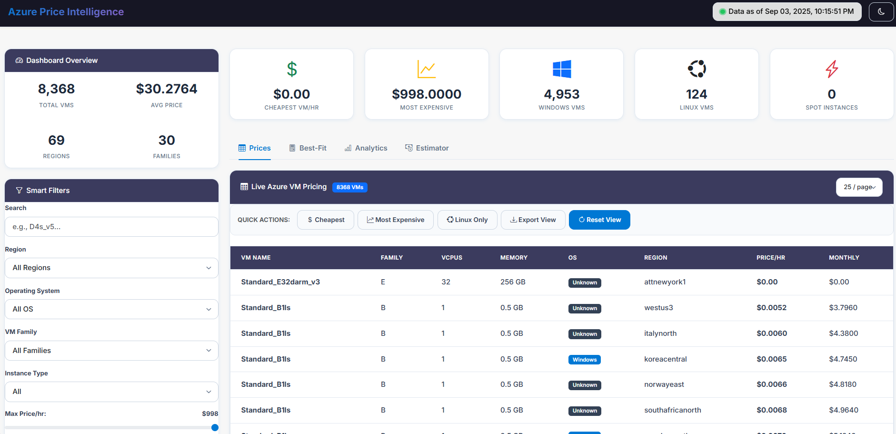
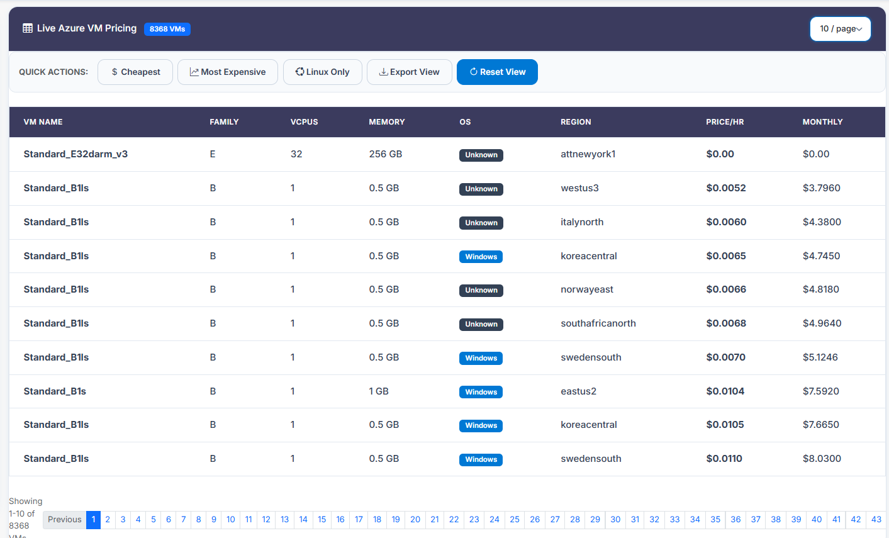
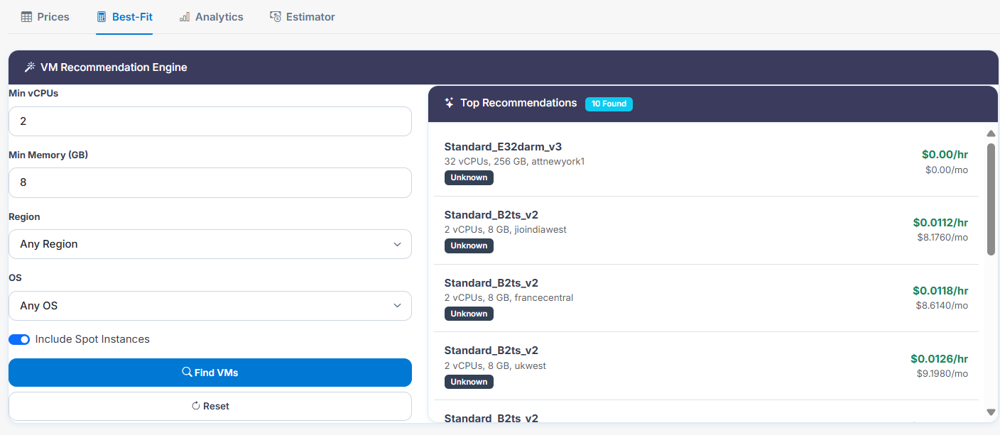
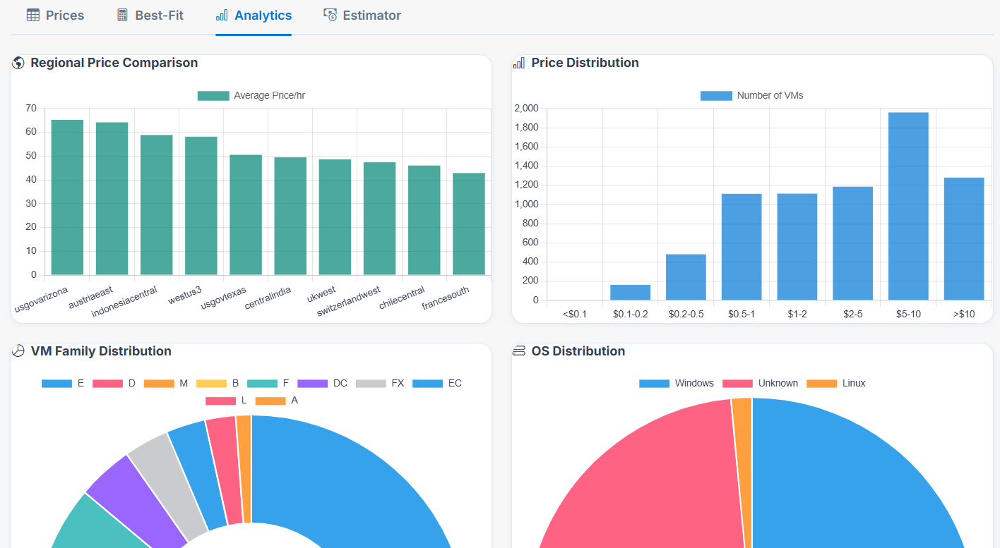
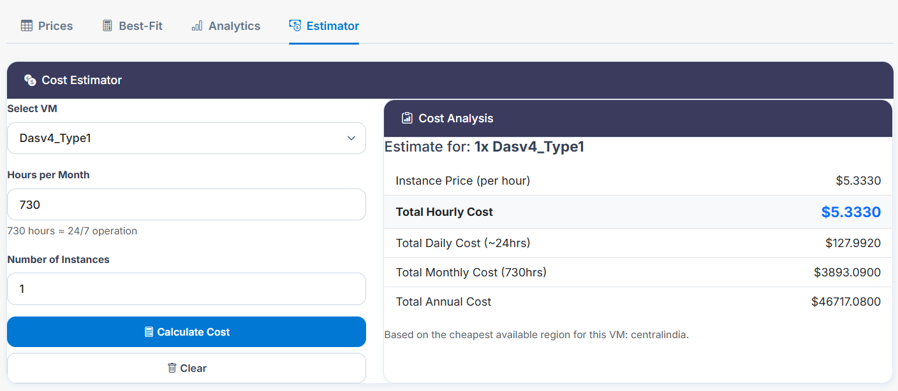

# ☁️ Azure Intelligent Overview


**Azure Intelligent Overview** is a **premium cloud dashboard** for professionals to **visualise, analyse, and optimise Azure VM pricing and specifications**.

It combines **real-time pricing intelligence**, **cost calculators**, and **advanced analytics** to help you make smarter, data-driven decisions when working with Azure cloud infrastructure.

---

## 📑 Table of Contents

* [Live Demo](#-live-demo)
* [Screenshots](#-screenshots)
* [Features](#-features)
* [Project Structure](#-project-structure)
* [Getting Started](#-getting-started)
* [Usage](#-usage)
* [Contributing](#-contributing)
* [Licence](#-licence)
* [Author](#-author)
* [Acknowledgements](#-acknowledgements)

---

## 🌐 Live Demo

🔗 **[View the Dashboard](https://sanilpanchal23.github.io/Azure-Intelligent-Overview/)**

*(Hosted via GitHub Pages)*

---

## 📸 Screenshots

| Dashboard Overview                                    | Prices                                  | Best-Fit (Price Calculator)                | Analytics                                     | Estimator                                     |
| ----------------------------------------------------- | --------------------------------------- | ------------------------------------------ | --------------------------------------------- | --------------------------------------------- |
|  |  |  |  |  |


## ✨ Features

* **Modern Dashboard UI** – Responsive interface built with **Bootstrap 5** and custom styles
* **Live Azure VM Pricing** – Real-time data for all **Azure SKUs, regions, OS types, and spot pricing**
* **Advanced Filtering** – Filter instantly by **region, OS, VM family, vCPUs, memory and price**
* **Price Calculator (Best-Fit)** – Input workload requirements to get the **top 10 cheapest VM matches**
* **Cost Estimator** – Calculate **hourly, daily, monthly, and yearly** costs by VM, region, and instance count
* **Interactive Charts (Analytics)** – Price distributions, VM family breakdowns, and other visual analytics with **Chart.js**
* **Export to CSV** – Download filtered VM data for offline analysis
* **Theme Toggle** – Switch between **light and dark modes** for comfortable viewing
* **Automated Price Scanning** – Python scripts pull the latest prices from **Azure Retail Prices API**
* **VM Specs Lookup** – Query hardware specifications using a Python tool
* **Data Storage** – All pricing and metadata stored in **JSON** for easy updates and integration

---

## 📂 Project Structure

```text
README.md
/dashboard/
    index.html             # Main dashboard UI (HTML, CSS, JS)
    data/
        azure_prices.json  # Azure VM pricing data (auto-updated)
/scripts/
    azure_price_scanner.py # Fetches latest Azure VM prices
    vm_specs_lookup.py     # VM specs lookup tool
    requirements.txt       # Python dependencies
/assets/
    screenshot-overview.png
    screenshot-prices.png
    screenshot-bestfit.png
    screenshot-analytics.png
    screenshot-estimator.png
```

---

## 🚀 Getting Started

### 🔧 Prerequisites

* **Python 3.10+**
* **pip** (Python package manager)
* Modern web browser (Chrome, Edge, Firefox, etc.)

### 💻 Installation

1. Clone the repository:

   ```bash
   git clone https://github.com/Sanilpanchal23/Azure-Intelligent-Overview.git
   cd Azure-Intelligent-Overview
   ```

2. Install dependencies:

   ```bash
   cd scripts
   pip install -r requirements.txt
   ```

---

## 🖥️ Usage

### 1. Update Azure VM Pricing Data

Run the price scanner:

```bash
python azure_price_scanner.py
```

Updates `azure_prices.json` with current pricing.

### 2. Lookup VM Specifications

Run the specs lookup tool:

```bash
python vm_specs_lookup.py
```

### 3. View the Dashboard

Open `/dashboard/index.html` in your browser.

### 4. Explore Dashboard Features

* **Dashboard Overview** – See a complete summary of VM pricing and analytics
* **Live Status (Prices)** – Last updated timestamps
* **Best-Fit Price Calculator** – Quickly find cheapest VM matches for your workload
* **Analytics** – Interactive charts and breakdowns of VM distributions
* **Cost Estimator** – Enter usage details → get full hourly/monthly/yearly cost breakdowns
* **Export to CSV** – Save filtered datasets
* **Theme Toggle** – Light/dark UI
* **Notifications** – Instant feedback for updates, exports, and errors

---

## 🤝 Contributing

Contributions are welcome!

1. Fork the repo
2. Create a branch for your feature/fix
3. Open a pull request with a clear description

Ideas for **new analytics, UI improvements, or integrations** are highly encouraged.

---

## 📜 Licence

Released under the **MIT Licence**.
See [LICENCE](LICENCE) for full details.

---

## 👨‍💻 Author

* **Sanil Panchal** – [GitHub](https://github.com/Sanilpanchal23)

---

## 🙏 Acknowledgements

* **Azure Retail Prices API** – For live pricing data
* **Python, Bootstrap, JavaScript, Chart.js** communities – Open-source tools used

---

✨ **Azure Intelligent Overview – Smarter Cloud Decisions with Real-Time Azure VM Pricing Intelligence.**


